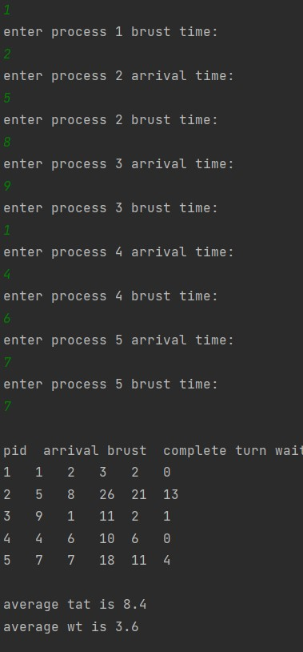

# CPU Scheduling Using Round-Robin And Shortest-Job-First 
This Project is to implement two types of Processor Scheduling(Round-Robin,Shortest-Job-First) by Java
## Round-Robin Schedling process
This Algorithm takes its name from the round-robin principle, which distributes something equally among all participants,and you can Check it Throw <a href ="https://github.com/zeo911/RR-SJF/blob/main/RR.java">RR.Java</a>file.
This program reads Process Waiting Time And TurnAround Time

## SJF Scheduling process

Shortest Job First (SJF) is a type of disk scheduling algorithm in the operating system in which the processor executes the job first that has the smallest execution time. In the shortest Job First algorithm, the processes are scheduled according to the burst time of these processes, You can Find its Algorithm Throw<a href="https://github.com/zeo911/RR-SJF/blob/main/SJF.java">SJF.java</a>.This program reads Process Waiting Time And TurnAround Time

 
